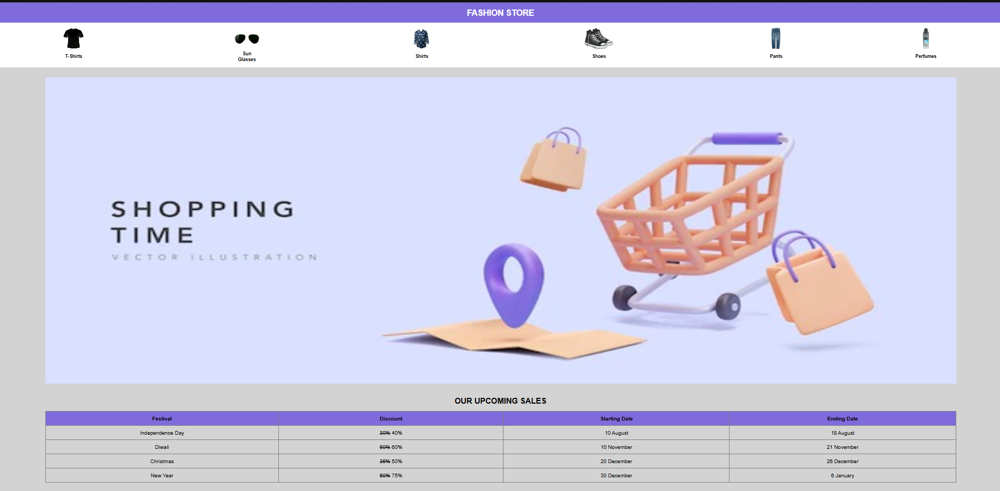
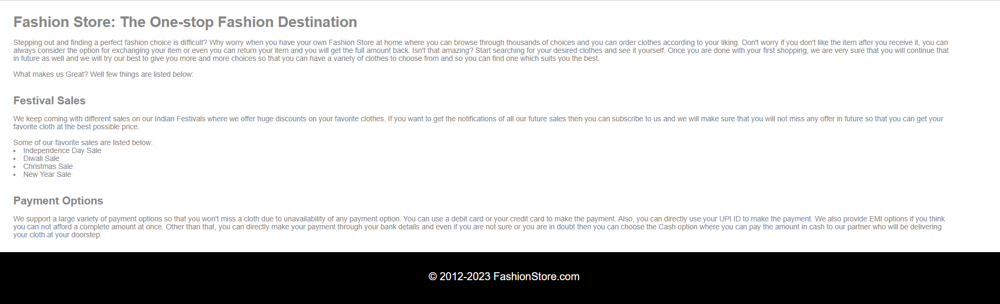

<h1>Fashion Store</h1>

<h3>Description</h3>

Fashion Store webpage shows an e-commerce website.

<h3>Project Screenshot</h3>

<h3>Features</h3>
<ul>
    <li>Items on sale</li>
    <li>Tabulated details about the Upcoming Sales</li>
    <li>About section of Fashion Store</li>
</ul>
<h3>Technologies used</h3>
<ul>
    <li>HTML5</li>
    <li>CSS</li>
</ul>
