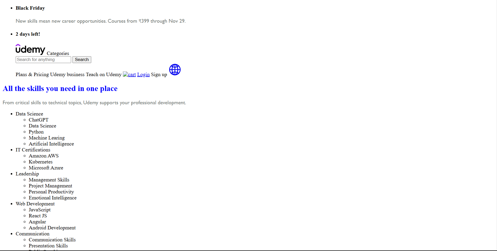
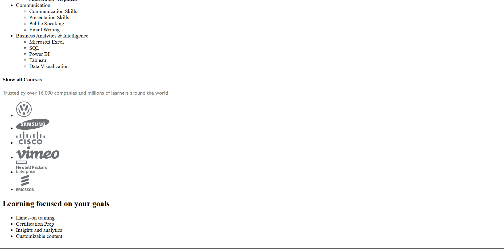
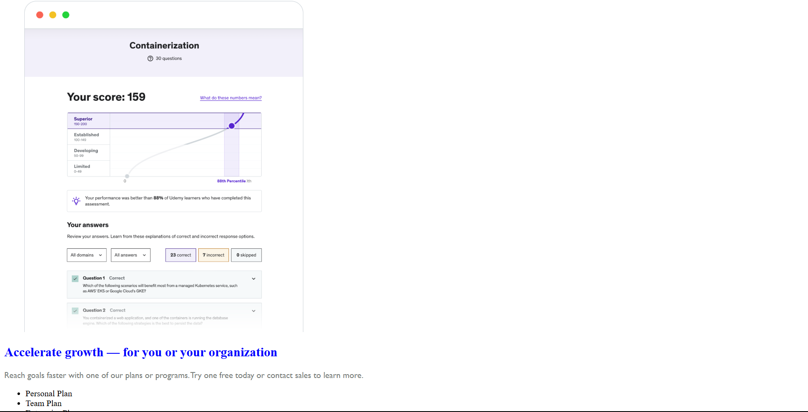
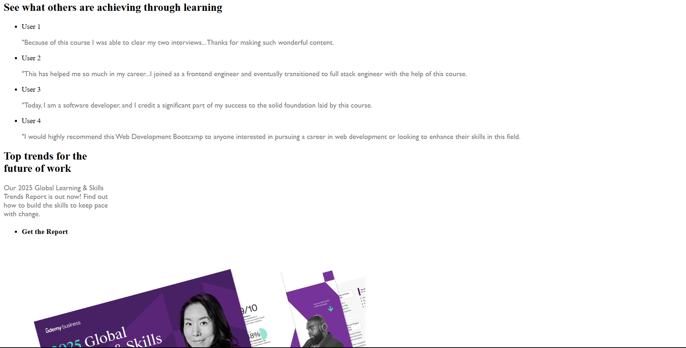
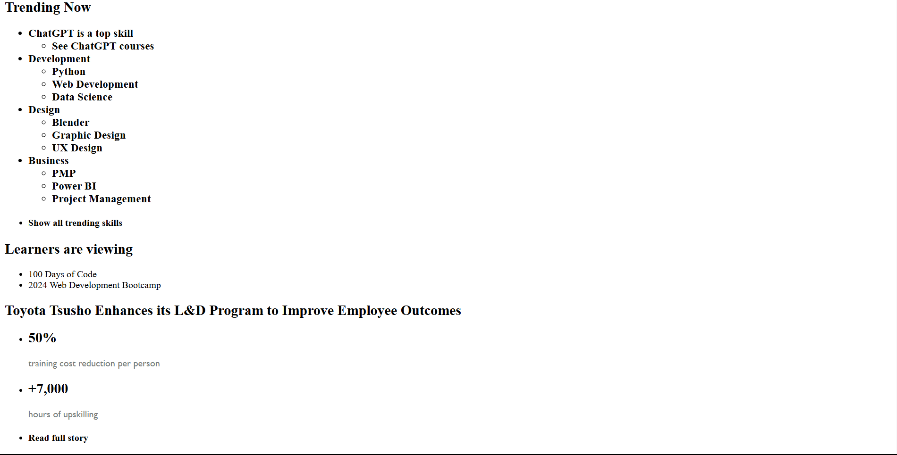
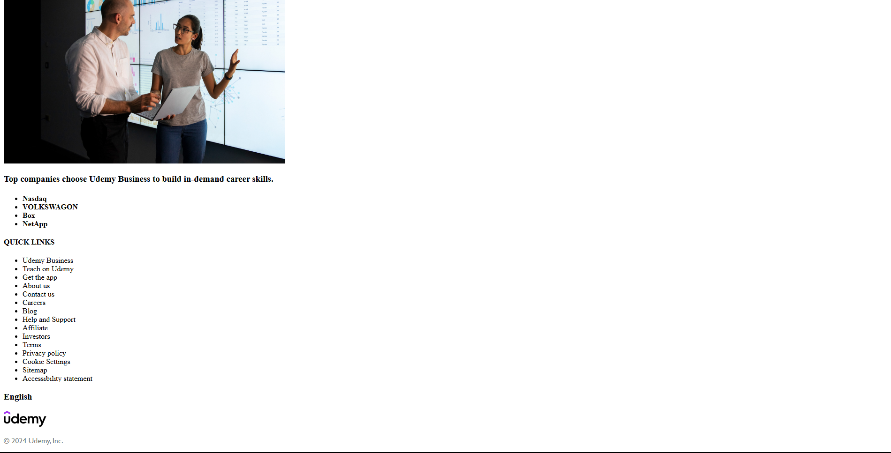

<h1>Udemy webpage</h1>

<h3>Description</h3>

 This is an clone of Udemy, an online learning platform that offers a wide range of courses on a variety of topics  

<h3>Project Screenshot</h3>

<h3>Features</h3>
<ul>
    <li>Flash Sale</li>
    <li>Navigation</li>
    <li>Skills</li>
    <li>List of Trusted Companies</li>
    <li>Goals</li>
    <li>Plans </li>
    <li>Testimonials</li>
    <li>Trends</li>
    <li>Achievements</li>
    <li>Footer</li>
</ul>

<h3>Technologies used</h3>
<ul>
    <li>HTML5</li>
    <li>CSS</li>
</ul>
